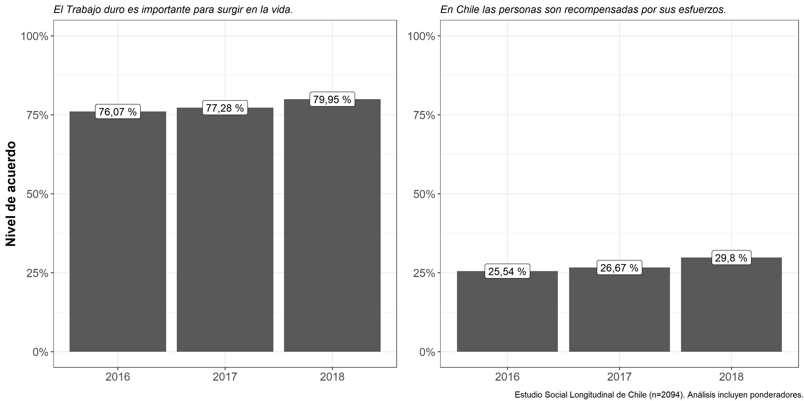
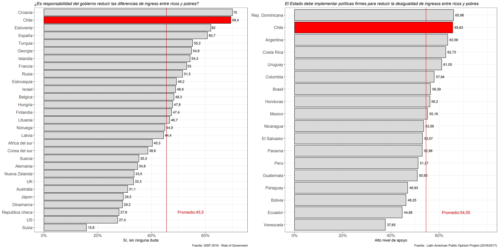
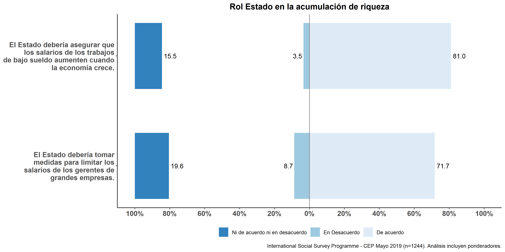

--- 

$^\text{a}$ Instituto de Sociología, Pontificia Universidad Católica de Chile, Chile.  
$^\text{b}$ Departamento de Sociología, Universidad de Chile, Chile.  
$^\text{c}$ Escuela de Sociología, Universidad Diego Portales, Santiago, Chile. 
$^\text{d}$ Centro de Investigación para la Gestión Integrada del Riesgo de Desastres (CIGIDEN), Santiago, Chile. 
$^\text{e}$ Centro de Estudios de Conflicto y Cohesión social (COES), Chile.

 

`r format(Sys.time(), "%d %b, %Y")`

[^1]: Autores correspondientes. E-mail address: [lmaldona@uc.cl](lmaldona@uc.cl), [juancastillov@uchile.cl](juancastillov@uchile.cl) y [jciturra@uc.cl](jciturra@uc.cl)

# Introducción

La opinión pública y las preferencias redistributivas de los ciudadanos han ganado una renovada atención en el estudio de reformas institucionales. Ellas aparecen como un termométro social que indica la temperatura de la sociedad respecto de la temática de la desigualdad y la demanda ciudadana por bienestar [@Soroka2009]. Junto a ello, la opinión pública también juega el rol de un actor que puede tanto promover como bloquear cambios a las reglas del juego en una sociedad [@Jensen&Nauman2016; @Pierson1996new ].

Junto a las preferencias redistributivas, otro ámbito de estudio relacionado con las actitudes hacia la desigualdad es el de la meritocracia. El concepto de meritocracia se utiliza para caracterizar contextos en los cuales los beneficios y recompensas se distribuyen de acuerdo a esfuerzo y talento individual [@Young1961]. Esta idea ha sido asociada a procesos de legitimación de desigualdad, ya que en sociedades modernas las diferencias de estatus encontrarían (al menos en parte) justificación en los méritos individuales [@Hadjar2008meritokratie].

El objetivo del presente texto es documentar la evolución reciente de las preferencias redistributivas de la ciudadanía en Chile. Junto a ello, también presentamos evidencia sobre actitudes respecto de la meritocracia, en tanto principio legitimador de diferencias en las sociedades actuales. Para ello, analizamos datos agregados y encuestas de opinión pública que representan la información de mejor calidad existentes en el país en términos de representatividad de la población y comparación internacional. Los análisis que presentamos pretenden aportar elementos para la discusión sobre las demandas sociales en el Chile actual desde el punto de vista de la opinión pública.   Además, discutimos algunas señales de la opinión pública que indican algunos caminos que podrían servir para satisfacer la demanda por redistribución en la ciudadanía.

# Evolución de la desigualdad y el gasto público

Dos características del contexto institucional chileno describen el marco estructural bajo el cual han evolucionado las preferencias de los ciudadanos en los últimos años. Una de ellas es el desarrollo de la desigualdad económica. En comparación con los países que forman la Organización para la Cooperación y el Desarrollo Económicos, la evidencia internacional muestra que la distribución del ingreso de Chile es una de las más desiguales [@OECD2018]. Ahora bien, desde nuestro punto de vista la tendencia clave para entender la evolución de las preferencias de los votantes en el país no refiere tanto a la comparación internacional como a la evolución de la desigualdad económica en el pasado reciente. La evidencia indica que la desigualdad del ingreso se ha mantenido casi constante. Tal como se ve en el panel de la izquierda de la figura 1, el coeficiente Gini ha tenido leves variaciones en los últimos años, desde 48 en 2009 a 46 en el 2017. Series de tiempo más extensas muestran que, pese a cambios en las últimas décadas, la desigualdad del ingreso en el país sigue siendo muy alta [@Desiguales2017].

Una segunda característica estructural es la intervención del Estado para disminuir la desigualdad económica en términos de impuestos, servicios públicos y transferencias. La evidencia para Chile indica que dicha intervención es de magnitud limitada. Para ilustrar, el panel de la derecha de la figura 1 muestra la evolución del gasto público en políticas sociales ---medido como porcentaje del PIB---para el periodo 2010-2017. Los resultados indican estabilidad: el gasto aumentó de 10,4% en 2010 a 10,9% en 2017. La figura 2 complementa estas tendencias con información sobre redistribución del ingreso según nivel de desarrollo económico de países miembros de la OCDE (medido con PIB per cápita). El indicador de redistribución mide la reducción en términos porcentuales del coeficiente Gini que se debe a transferencias e impuestos. La mayoría de la información es para el 2016, aunque hay algunos países con información del 2017. El tamaño de las burbujas en el gráfico captura la mágnitud de la redistribución (burbujas más grandes indican mayor reducción de la desigualdad de ingreso) y la línea horizontal resume el nivel de redistribución de cada país que se puede predecir según el PIB de estos. Como se puede notar, Chile presenta el nivel de redistribución más bajo de la muestra de países OCDE analizada. Ahora bien, más interesante es el hecho de que hay países con PIBs per cápitas similares al de Chile pero cuya magnitud de reducción de la desigualdad es claramente mayor (Rusia, Latvia, Lituania, Costa Rica).

Tanto los niveles de desigualdad como el esfuerzo del Estado para intervenir en ella conforman un marco institucional que moldea las preferencias de los ciudadanos. En un contexto en donde los niveles desigualdad y de intervención estatal han experimentado cambios limitados, ¿cómo perciben los ciudadanos las oportunidades que hay en la sociedad para salir adelante en la vida? ¿son consistentes estas percepciones con la demanda por redistribución? En el siguiente sección, describimos la evolución de ambos tipos de actitudes en el Chile contemporáneo.

# Evolución de las preferencias redistributivas y percepciones sobre la meritocracia

Las oportunidades que las personas perciben para salir adelante en la vida son un importante determinante de las preferencias redistributivas [@McCall2013]. Dentro de la percepción de oportunidades, destaca la idea de mérito, entendido como la combinación de esfuerzo y habilidades individuales. Este constituye la base del ‘ideal meritocrático’, es decir, la creencia de que las personas obtienen lo que merecen en la medida que han trabajado duro por ello. La noción de meritocracia es una ideología que puede ser usada para justificar el modo como una sociedad debe asignar los recursos económicos.

Utilizando la base de datos del Estudio Social Longitudinal de Chile (ELSOC), analizamos la evolución de las percepciones sobre meritocracia en Chile entre 2016 y 2018. Nos centramos en la percepción de las personas sobre la importancia del trabajo duro para surgir en la vida, y nuestros resultados agrupan las categorías “Bastante Importante” y “Muy Importante” para mostrar el nivel de acuerdo con dicho factor. Así, mientras mayor la relevancia de éste, mayor sería la adhesión al ideal meritocrático. Como muestra el lado izquierdo de la figura 3, los resultados resaltan que, si bien existe una leve disminución desde 2016, aproximádamente un 75% de los encuestados está de acuerdo con que el trabajo duro es un medio esencial para el progreso vital.

También quisimos indagar si ese ideal meritocrático se traduce efectivamente en recompensas sociales. Para esto, analizamos el nivel de acuerdo con la afirmación “En Chile las personas son recompensadas por sus esfuerzos”. Al igual que en el caso anterior, por un lado agrupamos las respuestas “De Acuerdo” y “Totalmente de acuerdo”, y por otro “En desacuerdo” y “Totalmente en desacuerdo. El gráfico a la derecha de la figura 3 muestra el nivel de acuerdo con la afirmación en cuestión.

En una sociedad meritocrática, esperaríamos que el apoyo a la meritocracia y la percepción de recompensas sean consistentes; es decir, que las personas crean en el valor del trabajo y que la sociedad efectivamente los recompense por ello. Sin embargo, en Chile mientras la mayoría de los encuestados apoya el ideal meritocrático, solo una minoría (26%) siente que son recompensados por ello (lado derecho de figura 3).

En países donde más se apoya el esfuerzo y el mérito personal para salir adelante en la vida existe en general un menor apoyo a la redistribución [@Alesina2005; @Benabou2006]. Para Chile esperaríamos, entonces, una baja preferencia por redistribución, dada la relevancia de la meritocracia. Para evaluar esto, analizamos la valoración del igualitarismo en Chile (si se considera al bienestar como derecho social y si se apoyan políticas para esto, particularmente reducir diferencias de ingreso entre ricos y pobres) [@Feldman2001] . Si bien igualitarismo y demanda por redistribución no son exactamente lo mismo, en general están altamente correlacionados [@Azaretal2018].

El lado izquierdo de la figura 4 muestra el nivel de apoyo igualitarista y su cambio en las últimas décadas. Para ello, utilizamos un ítem de la encuesta mundial de valores con una escala de respuesta de 1 a 10, en donde 1 es “Debería haber mayor igualdad de ingresos” y 10 es “Debería haber mayor diferencia de ingreso como incentivo al esfuerzo individual” para el periodo 1990-2012. La figura 4 muestra el porcentaje de personas que señalan las opciones 1, 2 o 3, las que representan un fuerte nivel de igualitarismo. Como podemos notar, hay un aumento drástico hacia una preferencia por mayor igualdad, pasando de un 26% en 1990 a 60% en 2012. El lado derecho de la misma figura presenta datos de la encuesta CEP de junio 2019. Repitiendo la reagrupación de categorías de figuras anteriores, se confirma una muy alta preferencia a favor de la redistribución entre la población: casi un 74% de los encuestados señala que está de acuerdo con que es responsabilidad del Estado reducir las diferencias entre ricos y pobres.

También comparamos con otros países, especialmente con aquellos con desigualdad económica similar a Chile. Usando datos del International Social Survey Programme (ISSP) para 2016, el lado izquierdo de la figura 5 nos muestra que en Chile casi el 70% de los encuestados señala “Sí, sin ninguna duda” ante la pregunta de si es responsabilidad del gobierno reducir las diferencias de ingreso entre ricos y pobres, ubicándose como uno de los países con mayor demanda por redistribución entre naciones de ingreso medio y economías desarrolladas de la OECD incluidas en el ISSP. Al comparar con América Latina, y utilizando información sobre preferencias redistributivas del Latin American Public Opinion Project (LAPOP) para varios países de América Latina en el 2016/2017, encontramos ideas similares. Como se aprecia en el lado derecho de la figura 5, y frente a una afirmación similar a la anterior (“El Estado [país] debe implementar políticas firmes para reducir la desigualdad de ingresos entre ricos y pobres. ¿Hasta qué punto está de acuerdo o en desacuerdo con esta frase)?”, con valores entre 1 y 7, donde 1 representa “muy en desacuerdo” y 7 representa “muy de acuerdo”), el gráfico presenta un significativo porcentaje de encuestados que señalan valores de 6 ó 7. Con esto, la propuesta de una mayor redistribución no sólo se erige como una de las más altas en la OECD, sino también en América Latina.

# ¿Cómo responder a la demanda por redistribución? Señales desde la opinión pública

En el contexto chileno, ¿qué señales ha enviado la opinión pública que puedan ser de utilidad para responder a la demanda por redistribución en el país? Sobre la base de los recientes módulos del ISSP sobre gobierno (año 2016) y desigualdad (año 2019) nos referimos a dos áreas de relevancia.

La primera se relaciona con gasto público e intervención estatal. En la encuesta ISSP del 2016, se les preguntó a las personas si les gustaría que se gastara más o menos para áreas específicas de las políticas sociales, tales como educación y salud. La figura 6 muestra los resultados para cuatro áreas de la política social, que representan ámbitos clásicos en donde ha intervenido el Estado de bienestar. Como queda en evidencia, la demanda por un mayor gasto en estas áreas es claramente predominante en la población: más del 70% de los encuestados señala gastar más o gastar mucho más en las cuatro áreas. En salud y pensiones, el nivel de apoyo es del 91,1%. Junto a este patrón, quisiéramos destacar que las preguntas que estamos analizando también le señalan al encuestado que “Recuerde que si Ud. dice “mucho más”, podría ser necesario aumentar los impuestos”. Los resultados sugieren, entonces, que una porción significativa de la población no solo quiere un aumento del gasto público en transferencias y servicios, sino que está dispuesta a aceptar mayores impuestos por ello.

La encuesta CEP de junio de 2019 también refiere a formas adicionales de intervención social. Se les pidió a los entrevistados señalar su nivel de acuerdo con una serie de áreas de intervención. La figura 7 presenta el porcentaje de los entrevistados que señala estar de acuerdo (“Muy de acuerdo” más “De acuerdo”) con dos áreas para los cuales hay un amplio consenso en la población. Los resultados indican que el 81% de los entrevistados está de acuerdo con un mecanismo estatal que asegure que los salarios bajos aumenten con el crecimiento económico. Del mismo modo, y consistente con la amplia adhesión al igualitarismo, el 71,7% apoya que el Estado limite el salario de los gerentes de grandes empresas.

La segunda área de relevancia remite a la generación de mecanismos de integración social que sean vistos como legítimos por la ciudadanía. Chile está viviendo una de sus mayores crisis institucionales desde el retorno a la democracia, la cual está atravesada por una fractura del acceso al poder político [@Somma2019fractura].  La clase política chilena se ha desconectado de la ciudadanía expresada en movimientos sociales y la sociedad civil organizada. Esto también puede afectar las políticas sociales. Si bien algunas políticas sociales benefician a una porción significativa de la ciudadanía, ésta puede sentir que las políticas no los representan porque no han participado de su generación. Al analizar la encuesta CEP de junio del 2019 encontramos que esta idea tiene asidero. Como se observa en la figura 8, solo el 20,9% de los encuestados está de acuerdo con que las políticas públicas reflejan los intereses de la mayoría. Frente a la pregunta “¿Cuán diferentes cree usted serían las políticas públicas si los miembros del Congreso fueran más parecidos a los demás ciudadanos en términos de riqueza?", casi el 70% señala que éstas serían “Diferentes” o “Muy diferentes”. Estos hallazgos sugieren que la ciudadanía está a favor de una mayor igualdad económica entre los que legislan y los ciudadanos. Asimismo, esto revela que no solo sería importante entregar beneficios por parte del Estado, sino también hacer partícipes a los beneficiarios del proceso en el que se generó la política social en cuestión. De este modo, la política social es pensada como un problema de toda la comunidad, y así se podría evitar generar diferencias sociales---por ejemplo, entre los "necesitados" y el resto de los ciudadanos; o entre los ciudadanos y la elite---que puedan socavar la legitimidad del contrato social. La lógica moral de la política social, entonces, no descanza sobre la pregunta "¿cómo deberíamos nosotros resolver SUS problemas?", sino en "¿cómo deberíamos nosotros resolver NUESTROS problemas de bienestar social"?. Este tipo de inclusiones pueden servir como un efectivo mecanismo de integración social.

Un segundo mecanismo de integración social refiere al fortalecimiento de actores que intermedien entre los individuos y el Estado y el sistema político. Estos actores pueden canalizar institucionalmente las demandas de la ciudadanía, de modo de evitar crisis institucionales de gran magnitud. Un posible actor de este tipo son los trabajadores. Ellos fueron claves para el desarrollo de los Estados de bienestar en siglo XX. Sin embargo, los trabajadores han tenido un rol menor en el juego de poder en el Chile contemporáneo. Pese a esto, los datos de la encuesta CEP de junio del 2019 señalan que hay una gran demanda ciudadana por mayor colectivización de los intereses. Tal como muestra la figura 9, más del 70% de los encuestados está de acuerdo con la necesidad de sindicatos fuertes y con tener representación en directorios de grandes empresas. Ciertamente, los trabajadores fueron claves en el siglo XX y las condiciones sociales del siglo XXI son distintas, por lo que resulta importante mencionar también otros tipos de actores colectivos---como los movimientos sociales y la sociedad civil organizada. Más allá de señalar una opción específica, quisiéramos mostrar la demanda que hay en la ciudadanía por mecanismos de integración social que colectivicen los intereses de los individuos.

### Materiales suplementarios

Material para la replicación de los análisis realizados para la presente investigación se pueden encontrar en nuestro **[repositorio](https://github.com/jciturras/chile-1819)** y en **[Open Science Framework](https://osf.io/g4ek8/)**.

### Declaraciones de los autores

Luis Maldonado y Julio Iturra aportaron equitativamente en el proceso de redacción y análisis de datos. Juan Carlos Castillo y Jorge Atria aportaron con la edición y escritura del manustrito. Francisco Meneses aportó con ediciones generales. 

### Financiamiento

Este trabajo fue realizado a través del financiamiento de CONICYT/FONDECYT REGULAR/1160921. Así también con el apoyo de CONICYT/FONDAP/15130009.

# Referencias
